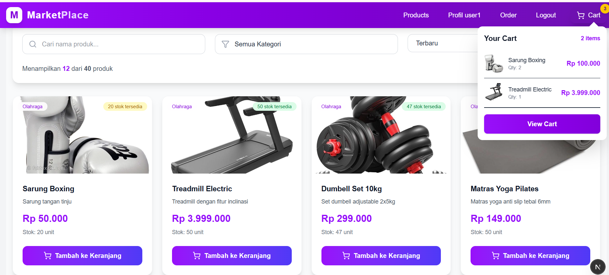
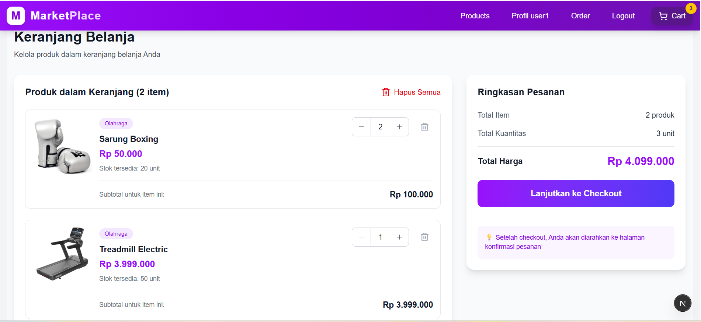

# 🛒 Marketplace Full-Stack Application
Sebuah aplikasi marketplace e-commerce full-stack dengan sistem dual-peran (User & Admin) yang dibangun menggunakan Next.js untuk frontend, Node.js/Express untuk backend, dan PostgreSQL untuk database.

---

## 🌟 Fitur Utama
### 👤 Untuk Pengguna (User)
- Autentikasi & Otorisasi - Register, Login, JWT Token
- Profil Pengguna - Lengkapi profil dengan foto, alamat, dan kontak
- Produk - Jelajahi produk dengan filter kategori, pencarian, dan sorting
- Keranjang Belanja - Tambah, edit, hapus, dan lihat detail keranjang
- Checkout System - Proses checkout dengan informasi pengiriman
- Riwayat Pesanan - Lacak status pesanan dari pembayaran hingga pengiriman

### 👑 Untuk Admin
- Manajemen Produk - CRUD produk (Create, Read, Update, Delete)
- Manajemen Kategori - Kelola kategori produk
-  Manajemen Pengguna - Lihat dan kelola data pengguna
- Manajemen Pesanan - Pantau dan kelola semua pesanan

---

## ⚙️ Instalasi & Menjalankan Proyek
### Clone Repository
```bash
git clone https://github.com/username/novelapp.git
```
### setup backend
```bash
cd back-end
npm install
```

### Buat file .env
```bash
PORT= 3000
NODE_ENV= development
BASE_URL= http://localhost:3000
DB_HOST= localhost
DB_PORT= 5432
DB_USER= postgres
DB_PASSWORD= your_password
DB_NAME= marketplace_db

JWT_SECRET= my_jwt_secret_key
JWT_EXPIRES_IN= 3d
```

### Jalankan Backend
```bash
npm run dev
```

### setup front-end
```bash
cd ../frontend
npm install
```

### Buat file .env
```bash
NEXT_PUBLIC_API_URL= http://localhost:3000/api
NEXT_PUBLIC_BASE_URL= http://localhost:3000/
```

### Jalankan Frontend
```bash
npm run dev
```

---

## 📸 Dokumentasi Aplikasi
### Tampilan List Produk


### Tampilan Cart
